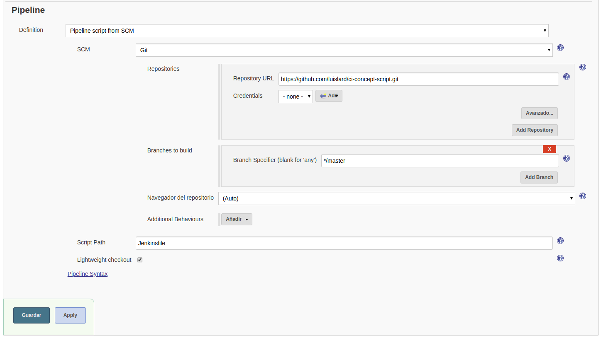
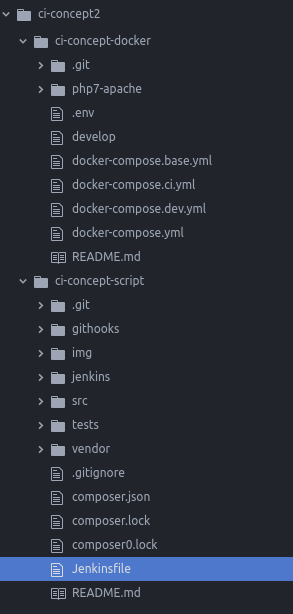

# How to set Continuous Integration for your project. (Only manually builds are covered.)

### Prerequisites.

* You will need a server with **Jenkins** (A.K.A Jenkins Server or Continuous Integration Server), **docker** and **docker-compose**.
* You will need to install the following plugins to Jenkins.
  * Git.
  * Pipeline.

1. Let's asume the most basic structure. Your project will have 2 folders.
  1. projectname-docker
  2. projectname-back

2. You will need to create a job in **Jenkins** for the docker project.
  * Click on **New Task**.
  * Put the name of your docker folder and select **free style**, then click OK at the bottom.
  * In Source Origin (Configurar el origen del código fuente) select Git.
  * Copy the HTTPS url of your repo and click Save. Done.

3. Then, create a pipeline for the project itself.
  * Click on **New Task**.
  * Put the name of your docker folder and select **pipeline**, then click OK at the bottom.

  

4. Then, add a **Jenkinsfile** in the root of your project.

  
